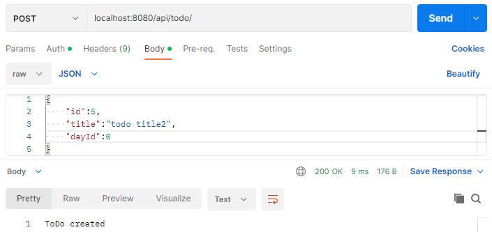
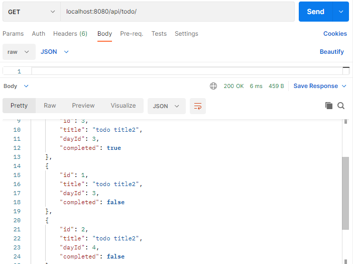
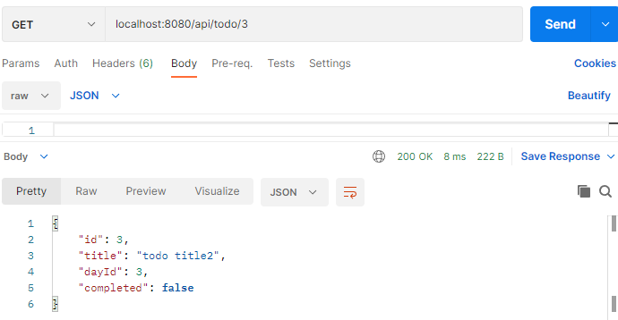
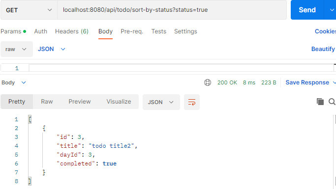
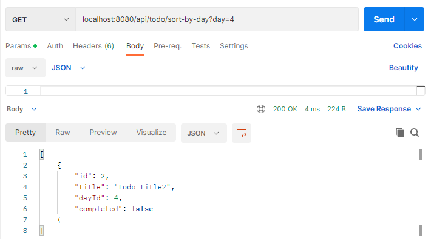

## Spring ToDo
***
### Routes
* #### ToDo oluşturma API

 ***
* #### Tüm ToDo listesi API

***
* #### ID'ye göre ToDo getirme API

***
* #### Tamamlanmış ya da tamamlanmamış ToDo'ya göre sıralama API

***
* #### ToDo Tamamlandı olarak işaretleme API
* localhost:8080/api/todo/completed/3
***
* #### İstenilen güne göre ToDo listeleme API

***
* #### ID'ye göre ToDo silme API
* localhost:8080/api/todo/3